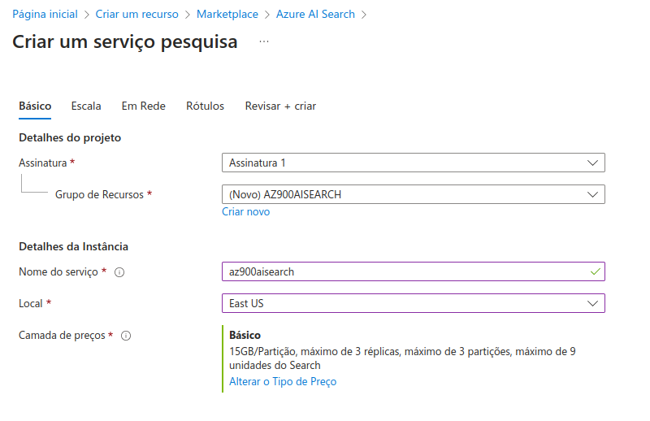
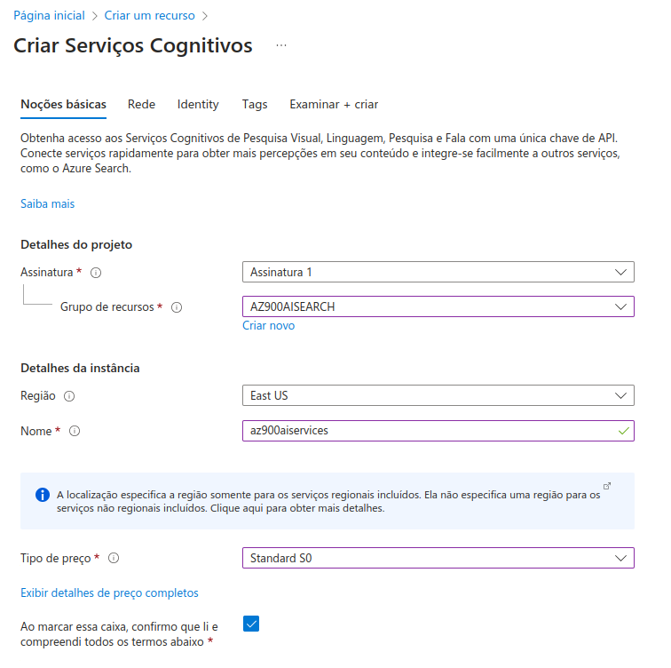
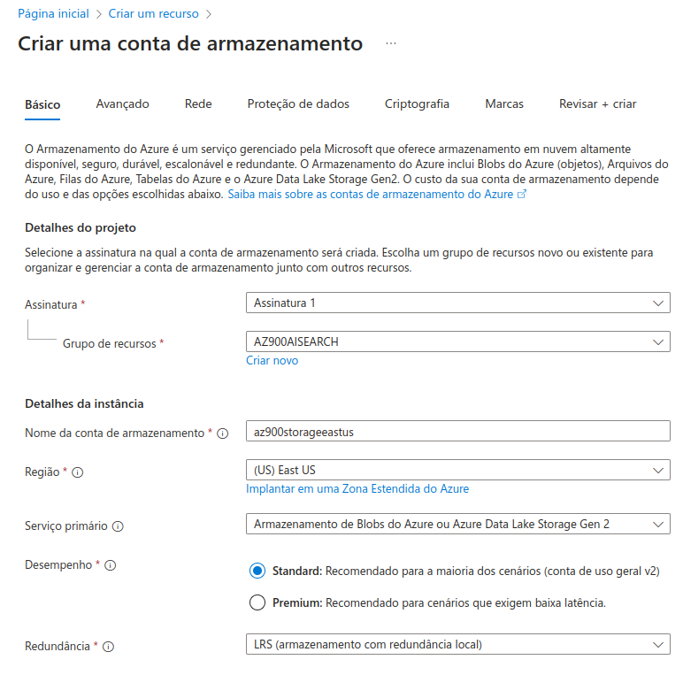
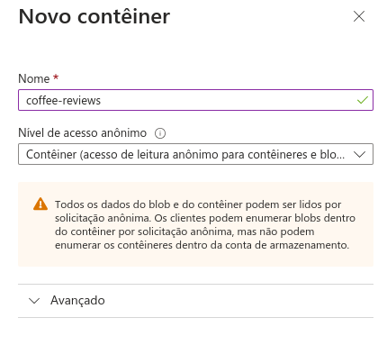
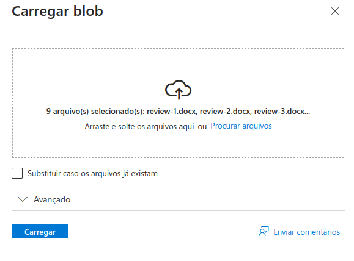
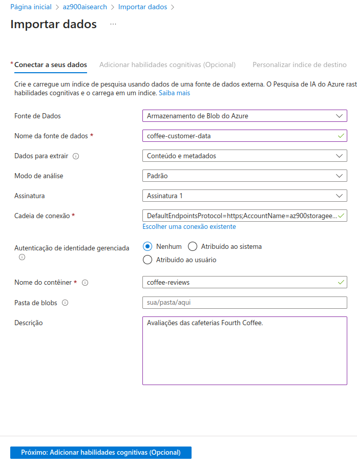
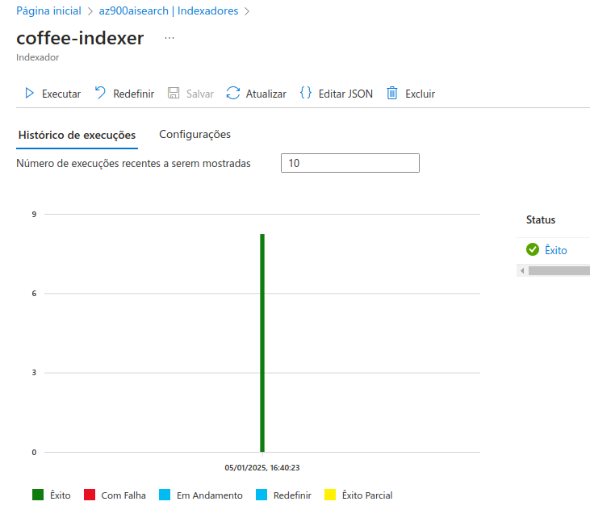
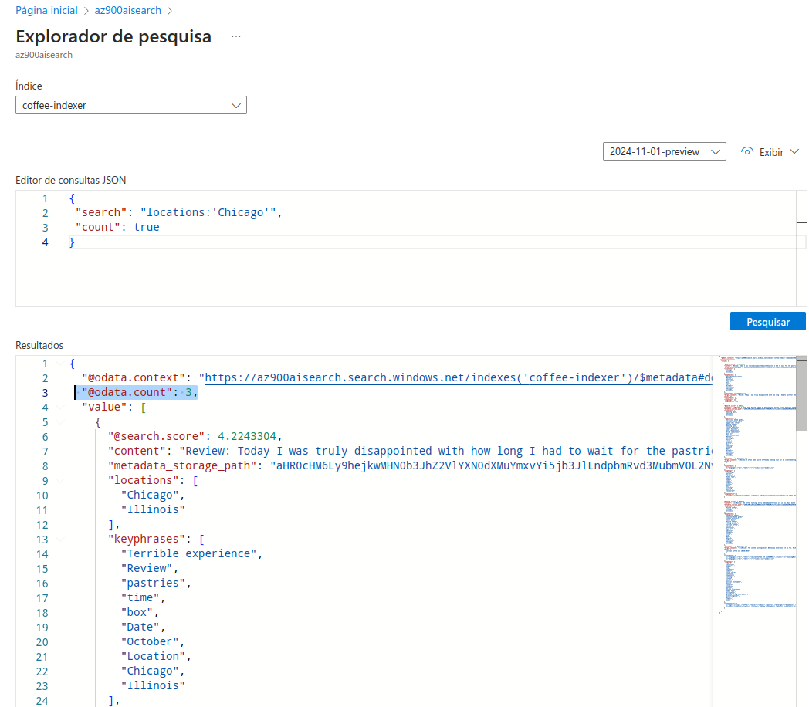
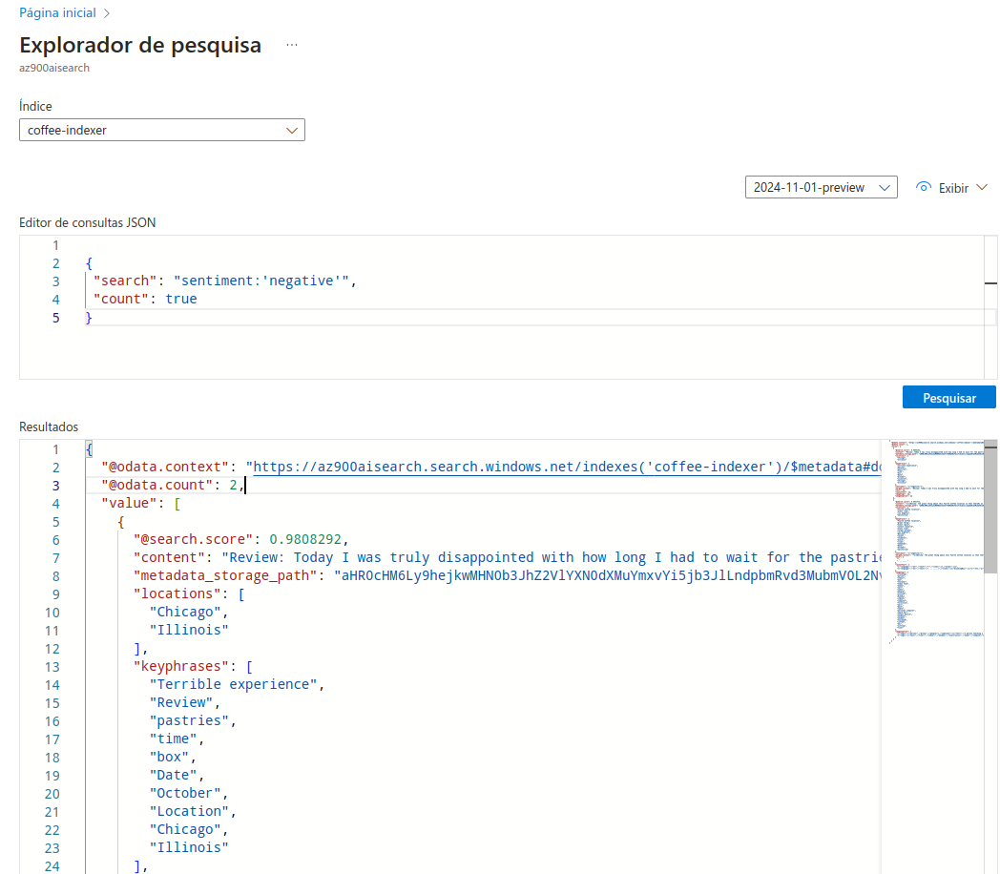

<h1>
    
    Microsoft - Fundamentos de IA 
</h1>

# :computer: Desafio de projeto: Azure Cognitive Search: Utilizando AI Search para indexação e consulta de Dados

O objetivo desse desafio é explorar o Azure AI Search para fazer pesquisas avançadas seguindo o [tutorial no Microsoft Learn](https://microsoftlearning.github.io/mslearn-ai-fundamentals/Instructions/Labs/11-ai-search.html)

## Explorar um índice de pesquisa do Azure AI (IU)

Vamos imaginar que você trabalha para a Fourth Coffee, uma rede nacional de cafés. Você é solicitado a ajudar a construir uma solução de mineração de conhecimento que facilite a busca por insights sobre experiências de clientes. Você decide construir um índice do Azure AI Search usando dados extraídos de avaliações de clientes.

Neste laboratório você irá:

- Criar recursos do Azure
- Extrair dados de uma fonte de dados
- Enriqueça os dados com habilidades de IA
- Use o indexador do Azure no portal do Azure
- Consulte seu índice de pesquisa
- Revise os resultados salvos em um Knowledge Store

## Recursos do Azure necessários

A solução que você criará para o Fourth Coffee requer os seguintes recursos na sua assinatura do Azure:

- Um recurso do **Azure AI Search** , que gerenciará a indexação e a consulta.
- Um recurso de **serviços de IA do Azure** , que fornece serviços de IA para habilidades que sua solução de pesquisa pode usar para enriquecer os dados na fonte de dados com insights gerados por IA.

    Observação: os recursos do Azure AI Search e dos serviços do Azure AI devem estar no mesmo local!

- Uma **conta de armazenamento** com contêineres de blobs, que armazenarão documentos brutos e outras coleções de tabelas, objetos ou arquivos.

# :bulb: Solução do desafio

## Criando um recurso de pesquisa do Azure AI

## Criando um recurso de serviços de IA do Azure

## Criando uma conta de armazenamento

- Permitir acesso anônimo ao blob

    1. Na conta de Armazenamento do Azure que você criou, no painel de menu à esquerda, selecione Configuração (em Configurações ).
    2. Altere a configuração de Permitir acesso anônimo do Blob para Habilitado e selecione Salvar .
## Carregando documentos para o Armazenamento Azure

**Criando novo container**

baixando dados de [reviews](https://aka.ms/mslearn-coffee-reviews) e **adicionando ao container**

## Indexando os documentos 

Seguir o passo-a-passo em [Indexar os documentos
](https://microsoftlearning.github.io/mslearn-ai-fundamentals/Instructions/Labs/11-ai-search.html)

## Pesquisando com filtros

Após configurar o indexador é possível fazer pesquisas personalizadas com o **Explorador de pesquisa**.

