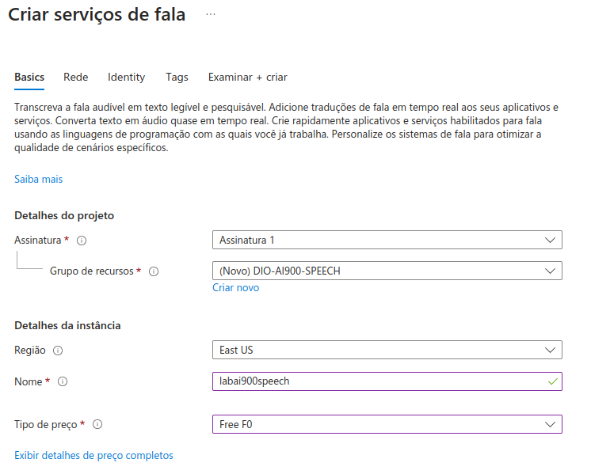
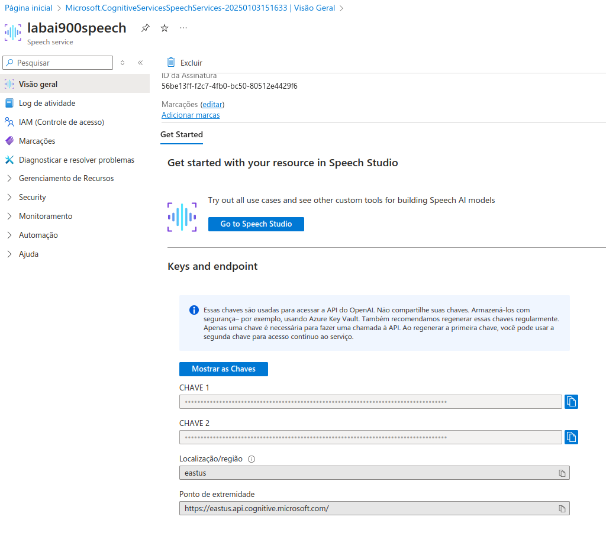
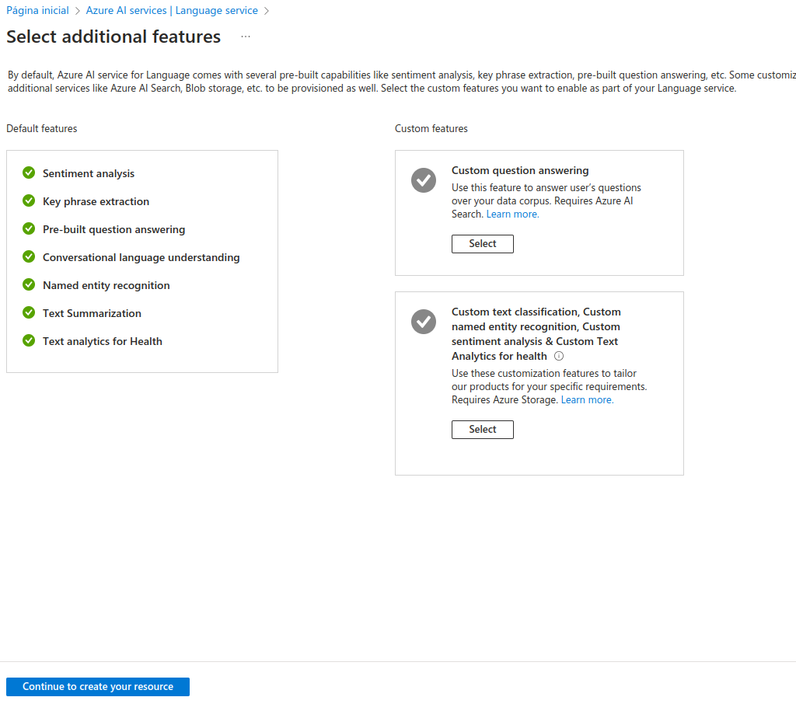
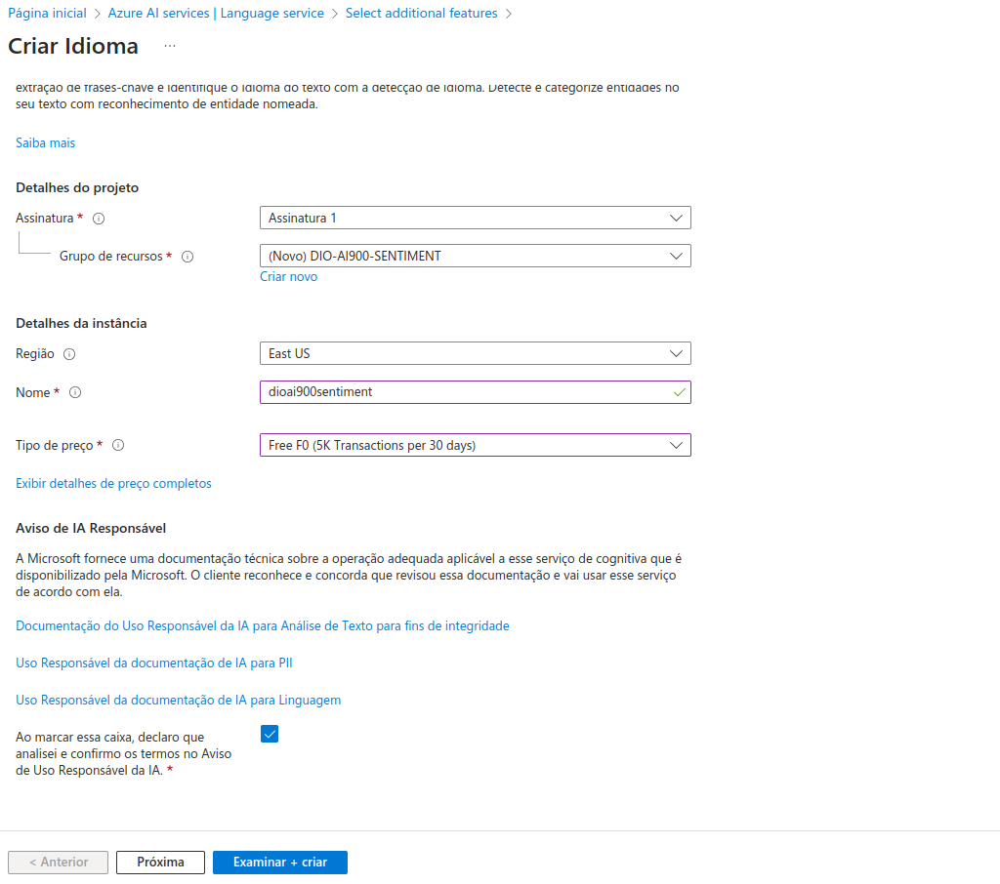
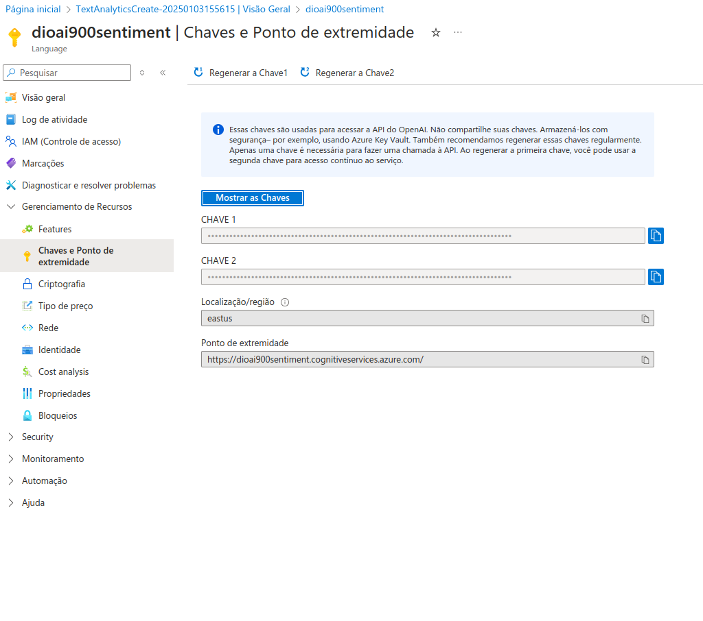

<h1>
    <a href="https://www.dio.me/">
     </a>
    <span>Microsoft - Fundamentos de IA </span>
</h1>

# :computer: Desafio de projeto: Análise de Sentimentos com Language Studio no Azure AI

Chegou a hora de você construir um portfólio ainda mais rico e impressionar futuros recrutadores, para isso é sempre importante mostrar os resultados do seu esforço e como você os obteve deixando claro o seu racional, para isso faça da seguinte maneira:

1. Crie um novo repositório no github com um nome a sua preferência
2. Crie uma pasta chamada 'inputs' e crie um documento de texto com algumas sentenças
3. Crie um arquivo chamado readme.md , deixe alguns prints descreva o processo, alguns insights e possibilidades que você aprendeu durante o conteúdo após a IA analisar suas sentenças
4. Compartilhe conosco o link desse repositório através do botão 'entregar projeto'
 
# :bulb: Solução do desafio

## Audio para texto

Copiei o arquivo de [audio](https://aka.ms/mslearn-speech-files) como indicado no [Lab/09-speech](https://microsoftlearning.github.io/mslearn-ai-fundamentals/Instructions/Labs/09-speech.html) do Microsoft Learn. Utilizei a chamada de API com python.

Criei o serviço de fala no Azure:



E copiei a chave e endpoint para um arquivo `.env`:



Função para processar arquivo de audio:

```python
def speech_to_text_from_file(file_path, speech_key, service_region):

    # Converter o arquivo .m4a para .wav
    audio = AudioSegment.from_file(file_path, format="m4a")
    wav_file_path = "temp_audio.wav"
    audio.export(wav_file_path, format="wav")

    # Criar uma configuração de fala
    speech_config = speechsdk.SpeechConfig(subscription=speech_key, region=service_region)
    
    # Criar um reconhecedor de fala a partir do arquivo .wav
    audio_input = speechsdk.AudioConfig(filename=wav_file_path)
    speech_recognizer = speechsdk.SpeechRecognizer(speech_config=speech_config, audio_config=audio_input)

    print("Processando o arquivo de áudio...")

    # Começar o reconhecimento de fala
    result = speech_recognizer.recognize_once()

    # Verificar o resultado do reconhecimento
    if result.reason == speechsdk.ResultReason.RecognizedSpeech:
        print("Texto reconhecido: {}".format(result.text))
    elif result.reason == speechsdk.ResultReason.NoMatch:
        print("Nenhuma correspondência de fala encontrada.")
    elif result.reason == speechsdk.ResultReason.Canceled:
        cancellation_details = result.cancellation_details
        print("Reconhecimento de fala cancelado: {}".format(cancellation_details.reason))
        if cancellation_details.reason == speechsdk.CancellationReason.Error:
            print("Detalhes do erro: {}".format(cancellation_details.error_details))
    pass
```

Obtendo a transcrição:

```python
 # Configurar a chave de assinatura e a região
speech_key = os.environ.get("SPEECH_KEY")
service_region = "eastus"
# Caminho do seu arquivo .m4a aqui
file_path = "resources/audio/WhatAICanDo.m4a"
speech_to_text_from_file(file_path, speech_key, service_region)
```

Resultado:

```console
Processando o arquivo de áudio...
Texto reconhecido: AI enables us to build amazing software that can improve healthcare, enable people to 
overcome physical disadvantages, empower smart infrastructure, create incredible entertainment experiences, 
and even save the planet.
```
O código completo está no arquivo `fala_para_texto.ipynb`

## Análise de sentimentos

Salvei os exemplos de reviews, disponíveis no [abs/06-text-analysis](https://microsoftlearning.github.io/mslearn-ai-fundamentals/Instructions/Labs/06-text-analysis.html) do Microsoft Learn, em arquivos de texto. 

Criei um serviço *Language*



Criei o Idioma:



E copiei a chave e endpoint para usar a API:



Função para análise de sentimentos:

```python

def authenticate_client(subscription_key, endpoint):
    ta_credential = AzureKeyCredential(subscription_key)
    text_analytics_client = TextAnalyticsClient(
            endpoint=endpoint, 
            credential=ta_credential)
    return text_analytics_client

def analyze_sentiments(client, documents):
    response = client.analyze_sentiment(documents=documents)
    return response

def read_text_files(file_paths):
    documents = []
    for file_path in file_paths:
        with open(file_path, "r", encoding="utf-8") as file:
            text = file.read()
            documents.append(text)
    return documents
```

Processando os dois arquivos em uma chamada:

```python
subscription_key = os.environ.get("LANGUAGE_KEY")
endpoint = os.environ.get("LANGUAGE_ENDPOINT")

# Lista dos caminhos dos arquivos de texto
file_paths = ["resources/text/review1.txt", "resources/text/review2.txt"]

client = authenticate_client(subscription_key, endpoint)

documents = read_text_files(file_paths)

sentiment_response = analyze_sentiments(client, documents)

# Exibir resultados da análise de sentimento
for idx, document in enumerate(sentiment_response):
    print(f"Documento {idx + 1}:")
    print(documents[idx])
    print(f"Sentimento: {document.sentiment}")
    print("Confiança no Sentimento:")
    for sentiment, score in document.confidence_scores.items():
        print(f"  {sentiment}: {score:.2f}")
```

Resultado:

```console
Documento 1:
 Tired hotel with poor service
 The Royal Hotel, London, United Kingdom
 5/6/2018
 This is an old hotel (has been around since 1950's) and the room furnishings are average - becoming a bit old 
 now and require changing. The internet didn't work and had to come to one of their office rooms to check in for 
 my flight home. The website says it's close to the British Museum, but it's too far to walk.
Sentimento: negative
Confiança no Sentimento:
  positive: 0.00
  neutral: 0.09
  negative: 0.91
Documento 2:
 Good Hotel and staff
 The Royal Hotel, London, UK
 3/2/2018
 Clean rooms, good service, great location near Buckingham Palace and Westminster Abbey, and so on. We 
 thoroughly enjoyed our stay. The courtyard is very peaceful and we went to a restaurant which is part of the 
 same group and is Indian ( West coast so plenty of fish) with a Michelin Star. We had the taster menu which 
 was fabulous. The rooms were very well appointed with a kitchen, lounge, bedroom and enormous bathroom. 
 Thoroughly recommended.
Sentimento: positive
Confiança no Sentimento:
  positive: 0.98
  neutral: 0.02
  negative: 0.00
```
O código completo está no arquivo `texto_sentimentos.ipynb`.

**Após as análises os serviços foram excluídos para evitar cobranças adicionais.**
