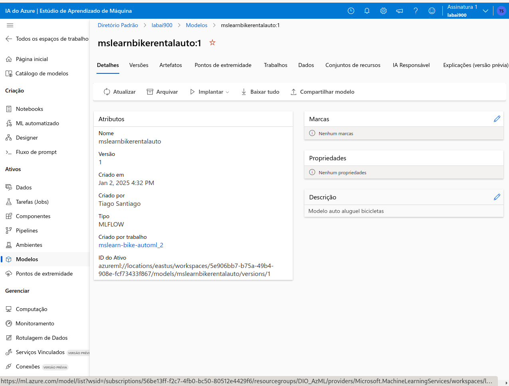
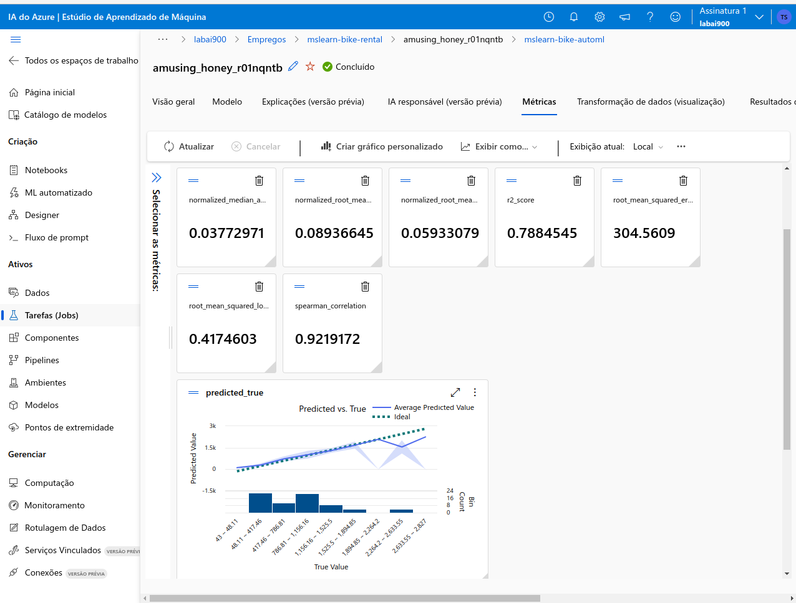
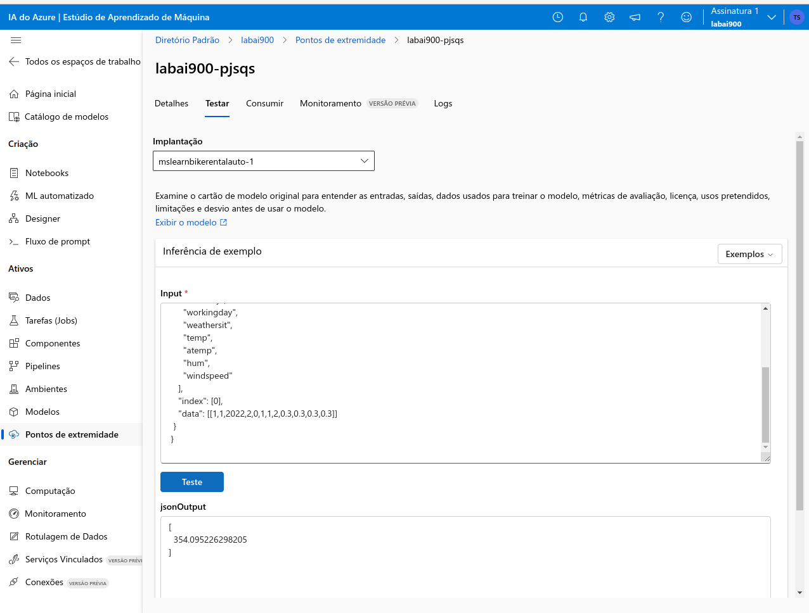

<h1>
    <a href="https://www.dio.me/">
     </a>
    <span>Microsoft - Fundamentos de IA </span>
</h1>

# :computer: Desafio de projeto: Trabalhando com Machine Learning na Prática no Azure ML

O objetivo desse desafio é explorar o aprendizado de máquina automatizado no Azure Machine Learning seguindo o [tutorial no Microsoft Learn](https://microsoftlearning.github.io/mslearn-ai-fundamentals/Instructions/Labs/01-machine-learning.html#use-automated-machine-learning-to-train-a-model)

# :bulb: Solução do desafio

Foi criado um novo recurso no Azure Machine Learning com as seguintes configurações:

-Assinatura : sua assinatura do Azure .
-Grupo de recursos : crie ou selecione um grupo de recursos .
-Nome : Insira um nome exclusivo para seu espaço de trabalho .
-Região : Leste dos EUA.
-Conta de armazenamento : observe a nova conta de armazenamento padrão que será criada para seu espaço de trabalho .
-Cofre de chaves : observe o novo cofre de chaves padrão que será criado para seu espaço de trabalho .
-Insights do aplicativo : observe o novo recurso padrão de insights do aplicativo que será criado para seu espaço de trabalho .
-Registro de contêiner : Nenhum ( um será criado automaticamente na primeira vez que você implantar um modelo em um contêiner ).

Dentro do **Resource Group** foi necessário atualizar as permissões de acesso ao recurso para poder criar o EndPoint no para o deployment do modelo. Em **Access control (IAM)**:

- No painel Controle de acesso (IAM) , selecione Adicionar atribuição de função . Em seguida, copie e cole Microsoft.MachineLearningServices/workspaces/datastores/listsecrets/action na barra de pesquisa.

- Selecione Administrador do Azure AI e selecione Avançar .

- Em Members , clique em + Select Members . Procure o endereço de e-mail associado à sua assinatura do Azure. Observação: se você passar o mouse sobre o canto superior direito do portal, deverá ver o endereço de e-mail usado com sua assinatura.

- Clique no e-mail associado à sua assinatura do Azure. Ele deve aparecer na lista Selected members . Em seguida, clique em Select .

- No painel Members , você deve ver um membro adicionado. Então selecione Review + Assign duas vezes para atualizar as configurações.

- Retorne ao painel Visão geral do seu grupo de recursos. Na lista de recursos, selecione seu recurso de espaço de trabalho do Azure Machine Learning.

Após abrir o Azure Machine Learning Studio, segui o passo-a-passo para treinar o modelo.

## Use aprendizado de máquina automatizado para treinar um modelo

O machine learning automatizado permite que você experimente vários algoritmos e parâmetros para treinar vários modelos e identificar o melhor para seus dados. Neste exercício, você usará um conjunto de dados de detalhes históricos de aluguel de bicicletas para treinar um modelo que prevê o número de aluguéis de bicicletas que devem ser esperados em um determinado dia, com base em características sazonais e meteorológicas.

    Citação : Os dados usados ​​neste exercício são derivados do Capital Bikeshare e são usados ​​de acordo com o contrato de licença de dados publicado .

1. No Azure Machine Learning Studio , visualize a página ML automatizado (em Criação ).

2. Crie um novo trabalho de ML automatizado com as seguintes configurações, usando Avançar conforme necessário para avançar pela interface do usuário:

    **Configurações básicas**:

    - Nome do trabalho : O campo Nome do trabalho já    deve estar preenchido previamente com um nome  exclusivo. Mantenha-o como está.
    - Novo nome do experimento :mslearn-bike-rental
    - Descrição : Aprendizado de máquina automatizado   para previsão de aluguel de bicicletas
    - Tags : nenhuma

    **Tipo de tarefa e dados**:

    - Selecione o tipo de tarefa : Regressão
    - Selecionar conjunto de dados : Crie um novo   conjunto de dados com as seguintes configurações:
    - Tipo de dados :
        - Nome :bike-rentals
        - Descrição :Historic bike rental data
        - Tipo : Tabela (mltable)
    - Fonte de dados :
        - Selecione De arquivos locais
    - Tipo de armazenamento de destino :
        - Tipo de armazenamento de dados : Azure Blob   Storage
        - Nome : workspaceblobstore
    - Seleção de MLtable :
        - Pasta de upload : Baixe e descompacte a   pasta que contém os dois arquivos que você    precisa enviar https://aka.ms/bike-rentals

    Selecione **Criar** . Após a criação do conjunto de dados, selecione o conjunto de dados bike-rentals para  continuar a enviar o trabalho de ML automatizado.

    **Configurações da tarefa**:

    - Tipo de tarefa : Regressão
    - Conjunto de dados : aluguel de bicicletas
    - Coluna de destino : aluguéis (inteiro)
    - Configurações adicionais :
        - Métrica primária : NormalizedRootMeanSquaredError
        - Explique o melhor modelo : Não selecionado
        - Habilitar empilhamento de conjunto : Não selecionado
        - Usar todos os modelos suportados : Não selecionado. Você restringirá o trabalho para tentar apenas alguns algoritmos específicos.
        - Modelos permitidos : Selecione apenas RandomForest e LightGBM — normalmente você tentaria o máximo possível, mas cada modelo adicionado aumenta o tempo necessário para executar o trabalho.
    - Limites : Expandir esta seção
        - Máximo de ensaios :3
        - Máximo de ensaios simultâneos :3
        - Máximo de nós :3
        - Limite de pontuação métrica : 0.085( para que se um modelo atingir uma pontuação métrica de erro quadrático médio normalizado de 0,085 ou menos, o trabalho termine. )
        - Tempo limite do experimento :15
        - Tempo limite de iteração :15
        - Habilitar rescisão antecipada : Selecionado
    - Validação e teste :
        - Tipo de validação : Divisão de validação de trem
        - Porcentagem de dados de validação : 10
        - Conjunto de dados de teste : Nenhum

    **Calcular**:

    - Selecione o tipo de computação : Sem servidor
    - Tipo de máquina virtual : CPU
    - Camada de máquina virtual : Dedicada
    - Tamanho da máquina virtual : Standard_DS3_V2*
    - Número de instâncias : 1
    
    Se sua assinatura restringir os tamanhos de VM disponíveis para você, escolha qualquer tamanho disponível.

3. Envie o trabalho de treinamento. Ele inicia automaticamente.

4. Espere o trabalho terminar. Pode levar um tempo — agora pode ser uma boa hora para um coffee break!


## Modelo treinado

Após o término do trabalho, clicar no Modelo de Rergistro, é possível ver o modelo:



Clicando no nome abaixo de Criado por trabalho
`mslearn-bike-automl_2` podemos ver as métricas:



## Gerando o EndPoint para teste

1. Na guia Modelo para o melhor modelo treinado pelo seu trabalho de aprendizado de máquina automatizado, selecione Implantar e use a opção Ponto de extremidade em tempo real para implantar o modelo com as seguintes configurações:
    - Máquina virtual : Standard_DS3_v2
    - Contagem de instâncias : 3
    - Ponto final : Novo
    - Nome do ponto de extremidade : deixe o padrão ou certifique-se de que seja globalmente exclusivo
    - Nome da implantação : Deixe o padrão
    - Inferência de coleta de dados : Desativado
    - Modelo de pacote : Desativado
2. Aguarde o início da implantação - isso pode levar alguns segundos. O status de Implantação para o endpoint predict-rentals será indicado na parte principal da página como Running .
3. Aguarde até que o status Deploy mude para Succeeded . Isso pode levar de 5 a 10 minutos.

**Teste o serviço implantado**

Agora você pode testar seu serviço implantado.

1. No Azure Machine Learning Studio, no menu à esquerda, selecione Endpoints e abra o endpoint em tempo real predict-rentals .

2. Na página do endpoint em tempo real do predict-rentals , visualize a guia Teste .

3. No painel Dados de entrada para testar o ponto de extremidade , substitua o JSON do modelo pelos seguintes dados de entrada:

    ```
    {
    "input_data": {
        "columns": [
        "day",
        "mnth",
        "year",
        "season",
        "holiday",
        "weekday",
        "workingday",
        "weathersit",
        "temp",
        "atemp",
        "hum",
        "windspeed"
        ],
        "index": [0],
        "data": [[1,1,2022,2,0,1,1,2,0.3,0.3,0.3,0.3]]
    }
    }
    ```

4. Clique no botão Testar .

5. Revise os resultados do teste, que incluem um número previsto de aluguéis com base nos recursos de entrada:



# Deletando os recursos para evira cobrança

1. Excluir o EndPoint no Azure Machine Learning Studio

2. Excluir grupo de recursos do Azure Machine Learning no portal do Azure

