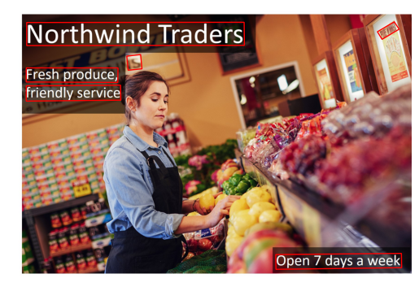
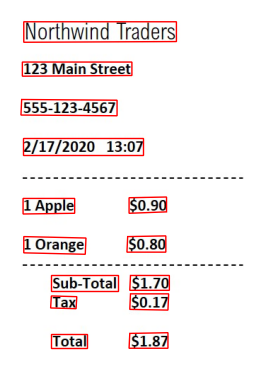

<h1>
    <a href="https://www.dio.me/">
     </a>
    <span>Microsoft - Fundamentos de IA </span>
</h1>

# :computer: Desafio de projeto: Reconhecimento Facial e transformação de imagens em Dados no Azure ML

Como Entregar esse projeto?

Chegou a hora de você construir um portfólio ainda mais rico e impressionar futuros recrutadores, para isso é sempre importante mostrar os resultados do seu esforço e como você os obteve deixando claro o seu racional, para isso faça da seguinte maneira:

1. Crie um novo repositório no github com um nome a sua preferência
2. Crie uma pasta chamada 'inputs' e salve as imagens que você utilizou
3. Crie uma pasta chamado 'output' e salve os resultados de reconhecimento de texto nessas imagens
4. Crie um arquivo chamado readme.md , deixe alguns prints descreva o processo, alguns insights e possibilidades que você aprendeu durante o conteúdo.
5. Compartilhe conosco o link desse repositório através do botão 'entregar projeto'

# :bulb: Solução do desafio

## OCR - lendo texto de imagens

Para reconhecimento de caracteres seguiremos os tutoriais do Microsoft Learn. ([tutorial 1](https://learn.microsoft.com/pt-br/azure/ai-services/computer-vision/quickstarts-sdk/client-library?tabs=linux%2Cvisual-studio&pivots=programming-language-python), [tutorial 2](https://microsoftlearning.github.io/mslearn-ai-fundamentals/Instructions/Labs/05-ocr.html))

Criando o recurso e as chaves de acesso

- Recurso do IA do Azure Vision. 
    - Use o tipo de preço gratuito (F0) para experimentar o serviço e atualizar mais tarde para um nível pago para produção.
- A chave e o endpoint do recurso que cria para ligar a sua aplicação ao serviço IA do Azure Vision.
    - Após a implantação do recurso Azure Vision, selecione Ir para o recurso.
    - No menu de navegação à esquerda, selecione Chaves e Ponto de Extremidade.
    - Copie uma das chaves e o Ponto de extremidade para usar posteriormente no início rápido.

A chave e o endpoint foram salvos em um arquivo .env para uso da API.

Instalando o pacote para visão computacional:

```console
pip install --upgrade azure-cognitiveservices-vision-computervision
```
Defini as funções para chamar a API de OCR para uma imagem local e para exibir a imagem com as bounding boxes nos textos detectados. O código completo está em `OCR_Azure.ipynb`

```python
def read_image_result(image_path, computervision_client):
    # Open the image
    image = open(image_path, "rb")
    read_response = computervision_client.read_in_stream(image, raw=True)

    # Get the operation location (URL with an ID at the end) from the response
    read_operation_location = read_response.headers["Operation-Location"]
    # Grab the ID from the URL
    operation_id = read_operation_location.split("/")[-1]

    # Call the "GET" API and wait for it to retrieve the results 
    while True:
        read_result = computervision_client.get_read_result(operation_id)
        if read_result.status not in ['notStarted', 'running']:
            break
        time.sleep(1)

    return read_result

def display_image_with_bounding_boxes(image_path, read_results):
    # Open the image
    image = Image.open(image_path)
    fig, ax = plt.subplots(1)
    ax.imshow(image)

    # Add bounding boxes to the image
    for text_result in read_result.analyze_result.read_results:
        for line in text_result.lines:
            bbox = line.bounding_box
            rect = patches.Polygon(
                [[bbox[i], bbox[i + 1]] for i in range(0, len(bbox), 2)],
                linewidth=1, edgecolor='r', facecolor='none'
            )
            ax.add_patch(rect)
            print(line.text)
    plt.axis('off')  # Hide the axes
    plt.show()
    pass
```

## Resultados

**Imagem com bounding boxes**:



**Texto retornado**:

```console
Northwind Traders
PIGE WINKER
Fresh produce,
IS
friendly service
Open 7 days a week
```

**Imagem com bounding boxes**:



**Texto retornado**:

```console
Northwind Traders
123 Main Street
555-123-4567
2/17/2020 13:07
1 Apple
$0.90
1 Orange
$0.80
Sub-Total
$1.70
Tax
$0.17
Total
$1.87
```